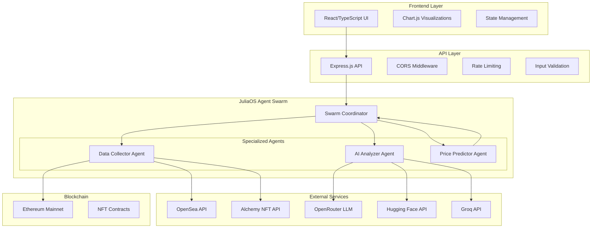

# JuliaOS NFT Predictor - Architecture Documentation

## System Overview

The JuliaOS NFT Price Predictor is a sophisticated multi-agent system that leverages JuliaOS's agent framework to provide AI-powered NFT price predictions. The system is designed with a modular architecture that ensures scalability, reliability, and maintainability.

## Architecture Diagram



## Component Details

### 1. Frontend Layer

**Technology Stack:**
- React 18 with TypeScript
- TailwindCSS for styling
- Framer Motion for animations
- Chart.js for data visualization
- Vite for build tooling

**Key Components:**
- `SearchForm`: Collection input with autocomplete
- `PredictionCard`: Results display with confidence metrics
- `AIReasoningDisplay`: Transparent AI analysis breakdown
- `LoadingSpinner`: Multi-stage loading indicators

**State Management:**
- Custom hooks for API interactions (`usePrediction`)
- React Context for global state
- Local state for component-specific data

### 2. API Layer

**Express.js Backend:**
- RESTful API design
- Comprehensive error handling
- Request validation and sanitization
- Rate limiting for API protection
- CORS configuration for frontend integration

**Key Endpoints:**
- `POST /api/predict` - Main prediction endpoint
- `GET /api/collections/search` - Collection search
- `GET /api/collection/:address/history` - Historical data
- `GET /api/health` - Agent status monitoring

**Middleware Stack:**
- Helmet for security headers
- Morgan for request logging
- Custom CORS configuration
- Rate limiting with sliding window
- Request/response compression

### 3. JuliaOS Agent Swarm

#### Swarm Coordinator Agent
**Responsibilities:**
- Orchestrate multi-agent workflows
- Handle inter-agent communication
- Manage error recovery and retries
- Aggregate results from specialized agents
- Provide unified interface to API layer

**Key Functions:**
```julia
execute_prediction_pipeline(collection_address)
get_agent_health()
search_collections(query)
```

#### Data Collector Agent
**Responsibilities:**
- Fetch NFT collection metadata
- Gather market data from multiple sources
- Collect social sentiment indicators
- Perform onchain data analysis
- Handle API rate limiting and fallbacks

**Data Sources:**
- OpenSea API (collection stats, metadata)
- Alchemy NFT API (contract data, ownership)
- Ethereum RPC (onchain verification)
- Social APIs (Twitter, Discord sentiment)

#### AI Analyzer Agent
**Responsibilities:**
- Perform LLM-powered market analysis
- Generate qualitative insights
- Assess market sentiment
- Identify key risk and opportunity factors
- Provide confidence scoring

**LLM Integration:**
- Primary: OpenRouter (free tier)
- Fallback 1: Hugging Face Inference API
- Fallback 2: Groq (fast inference)
- Final fallback: Rule-based analysis

**Analysis Components:**
- Market trend evaluation
- Social sentiment processing
- Technical indicator analysis
- Risk factor identification

#### Price Predictor Agent
**Responsibilities:**
- Generate multi-timeframe predictions (24h, 7d, 30d)
- Calculate confidence scores
- Assess prediction reliability
- Combine quantitative and qualitative data
- Generate risk assessments

**Prediction Algorithm:**
1. Base trend calculation from sentiment
2. Volume impact factor application
3. Technical indicator integration
4. Noise and uncertainty modeling
5. Confidence score computation

### 4. External Integrations

#### Free API Tiers Strategy
**Cost Optimization:**
- OpenSea: 1,000 requests/month free
- Alchemy: 300M compute units/month free
- Hugging Face: Free inference tier
- Groq: Free tier with rate limits

**Fallback Chain:**
1. Primary provider (best quality)
2. Secondary provider (backup)
3. Tertiary provider (last resort)
4. Mock data (development/demo)

#### LLM Provider Management
**Multi-Provider Architecture:**
- Cloud providers with free tiers
- Automatic failover on provider errors
- Provider health monitoring

## Data Flow

### 1. Prediction Request Flow
```
User Input → Frontend Validation → API Request → 
Swarm Coordinator → Data Collection → AI Analysis → 
Price Prediction → Result Aggregation → API Response → 
Frontend Display
```

### 2. Agent Coordination Flow
```
Coordinator receives request →
├─ Spawn Data Collector Agent
│  ├─ Fetch OpenSea data
│  ├─ Fetch Alchemy data  
│  ├─ Fetch onchain data
│  └─ Return aggregated data
├─ Spawn AI Analyzer Agent
│  ├─ Try OpenRouter LLM
│  ├─ Fallback to Hugging Face
│  ├─ Fallback to Groq
│  └─ Return analysis results
├─ Spawn Price Predictor Agent
│  ├─ Process market data
│  ├─ Apply AI insights
│  ├─ Generate predictions
│  └─ Calculate confidence
└─ Aggregate and return results
```

### 3. Error Handling Flow
```
Error Detected →
├─ Log error details
├─ Attempt retry (if applicable)
├─ Try fallback provider
├─ Use degraded functionality
└─ Return partial results with warnings
```

## Security Considerations

### API Security
- Rate limiting to prevent abuse
- Input validation and sanitization
- CORS configuration for cross-origin requests
- Helmet for security headers
- API key management for external services

### Data Privacy
- No persistent user data storage
- Temporary processing data only
- API keys secured in environment variables
- No sensitive data in client-side code

### Error Handling
- Comprehensive error catching
- Graceful degradation
- User-friendly error messages
- Detailed logging for debugging

## Performance Optimization

### Response Time Targets
- API response: <500ms average
- Prediction pipeline: <3s total
- Frontend rendering: <100ms
- Agent coordination: <1s overhead

### Optimization Strategies
- Concurrent agent execution
- Caching of frequent requests
- Connection pooling for external APIs
- Efficient data structures in Julia
- Frontend code splitting and lazy loading

### Monitoring Metrics
- Agent execution times
- API response rates
- Error frequency and types
- External service availability
- System resource usage

## Scalability Design

### Horizontal Scaling
- Stateless API design
- Agent isolation for parallel processing
- Load balancer compatibility
- Database-free architecture

### Resource Management
- Julia agent process pooling
- Memory-efficient data structures
- Garbage collection optimization
- Connection pooling for APIs

### Future Scaling Considerations
- Kubernetes deployment support
- Redis for distributed caching
- Message queue for async processing
- Database integration for persistence

## Development Workflow

### Environment Setup
1. Local development with mock data
2. Staging with rate-limited APIs
3. Production with full API access

### Testing Strategy
- Unit tests for individual agents
- Integration tests for agent coordination
- End-to-end tests for complete pipeline
- Load testing for performance validation

### CI/CD Pipeline
- Automated testing on commit
- Code quality checks (ESLint, Prettier)
- Security scanning
- Automated deployment to staging
- Manual production deployment

## Deployment Architecture

### Development
```
Local Machine:
├─ Frontend (Vite dev server)
├─ Backend (Node.js)
├─ Julia agents (local execution)
```

### Production
```
Cloud Infrastructure:
├─ Frontend (Vercel/Netlify CDN)
├─ Backend (Railway/Render containers)
├─ Julia agents (containerized)
└─ External LLM APIs
```

## Technology Decisions

### Frontend Framework Choice
**React + TypeScript chosen for:**
- Strong typing for data structures
- Component reusability
- Large ecosystem and community
- Excellent developer experience
- Performance optimizations

### Backend Framework Choice
**Node.js + Express chosen for:**
- JavaScript ecosystem consistency
- Excellent async I/O performance
- Rich middleware ecosystem
- Easy Julia process integration
- Rapid development cycle

### JuliaOS Integration
**Full framework utilization:**
- Native agent orchestration
- Built-in LLM integration
- Swarm coordination capabilities
- Onchain data interaction
- Performance optimization

This architecture ensures a robust, scalable, and maintainable system that demonstrates the full capabilities of the JuliaOS framework while providing real value to NFT traders and collectors.